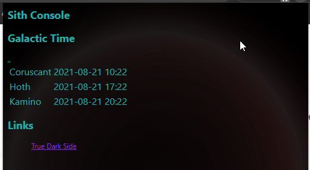
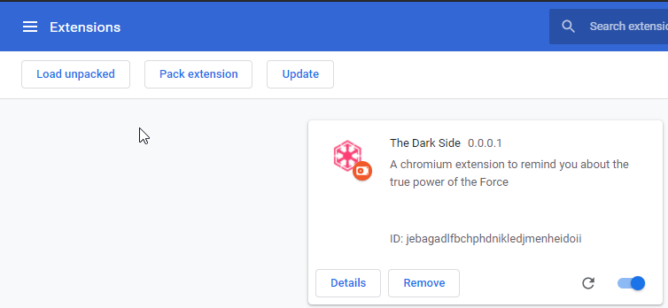
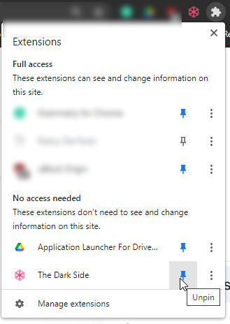

# Sith Console browser extension

## Description

A powerful browser extension to remind who you are.

## Features

Galactic Timezone Time: Coruscant (Seattle) -- this is where we shall build the Imperial Control Center; Hoth -- UTC time... it's cold there; Kamino -- Kyiv, it is far-far away.

Links: the most useful Sith links

## Installation
Open page: `chrome://extensions/`
Enable Developer Mode

Press "Load Unpacked" and select the extension folder.

Pin Extension to the extension bar

## Dev
Open VSCode in `reporoot`\dark-extension
Run tsc -w in terminal

## Resources:

[Create an extension tutorial - Part 1 - Microsoft Edge Development | Microsoft Docs](https://docs.microsoft.com/en-us/microsoft-edge/extensions-chromium/getting-started/part1-simple-extension)