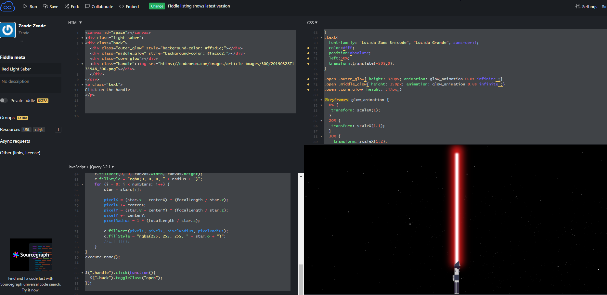

Source:
https://jsfiddle.net/iozcode/ws2hb7g1/


```html
<canvas id="space"></canvas>
<div class="light_saber">
<div class="back">
  <div class="outer_glow" style="background-color: #ff1d1d;"></div>
  <div class="middle_glow" style="background-color: #faccd2;"></div>
  <div class="core_glow"></div>
  <div class="handle"></div>
  </div>
</div>
<p class="text">
Click on the handle
</p>

```


```css
body{
  padding:0px;
  margin:0px;
}
#space{
    position: fixed;
}
.light_saber {
  height: 460px;
  width: 10px;
  margin-left: auto;
  margin-right: auto;
}
.back{
  height: 460px;
  width: 10px;
  position: relative;
  transform: rotate(180deg);
}
.outer_glow{
  height: 0px;
  width: 26px;
  border-radius:5px;
  filter: blur(10px);
    position: absolute;
    left: -8px;
    top:85px;
    transition: all 0.6s cubic-bezier(0.860, 0.000, 0.070, 1.000);
    //animation: lightUp2 0.6s cubic-bezier(0.860, 0.000, 0.070, 1.000);
    //animation: glow_animation 0.8s infinite;
}
.middle_glow{
  height: 0px;
  width: 10px;
  border-radius:5px;
  position: absolute;
  top:85px;
  filter: blur(2px);
  transition: all 0.6s cubic-bezier(0.860, 0.000, 0.070, 1.000);
  //animation: lightUp1 0.6s cubic-bezier(0.860, 0.000, 0.070, 1.000);
  //animation: glow_animation 0.8s infinite ;
}
.core_glow{
  height: 0px;
  width: 6px;
  background-color: #fff;
  border-radius:5px;
  position: absolute;
  top:85px;
  filter: blur(1px);
  transition: all 0.6s cubic-bezier(0.860, 0.000, 0.070, 1.000);
  //animation: lightUp3 0.6s cubic-bezier(0.860, 0.000, 0.070, 1.000);
  left: 2px;
}

.handle{
  height: 30px;
  width: 55px;
  position: absolute;
  top:0;
  left: -22px;
  cursor:pointer;
}
.handle img{
  width: 100%;
  height: auto;
  transform: rotate(180deg);
}
.text{
  font-family: "Lucida Sans Unicode", "Lucida Grande", sans-serif;
  color:#fff;
  position:absolute;
  left:50%;
  transform:translate(-50%,0);
}

.open .outer_glow{ height: 370px; animation: glow_animation 0.8s infinite ;}
.open .middle_glow{ height: 350px; animation: glow_animation 0.8s infinite ;}
.open .core_glow{ height: 347px;}

@keyframes glow_animation {
  0% {
   transform: scaleX(1);
  }
  20% {
   transform: scaleX(1.1);
  }
  30% {
    transform: scaleX(1.2);
  }
  60% {
    transform: scaleX(1.05);
  }
  80% {
    transform: scaleX(1.1);
  }
  100% {
    transform: scaleX(1);
  }
}

```

```javascript
window.requestAnimFrame = (function () { return window.requestAnimationFrame })();
var canvas = document.getElementById("space");
var c = canvas.getContext("2d");

var numStars = 1900;
var radius = '0.' + Math.floor(Math.random() * 9) + 1;
var focalLength = canvas.width * 2;
var warp = 0;
var centerX, centerY;

var stars = [], star;
var i;

var animate = true;

initializeStars();

function executeFrame() {

    if (animate)
        requestAnimFrame(executeFrame);
    moveStars();
    drawStars();
}

function initializeStars() {
    centerX = canvas.width / 2;
    centerY = canvas.height / 2;

    stars = [];
    for (i = 0; i < numStars; i++) {
        star = {
            x: Math.random() * 1920,
            y: Math.random() * 1080,
            z: Math.random() * 1920,
            o: '0.' + Math.floor(Math.random() * 99) + 1
        };
        stars.push(star);
    }
}

function moveStars() {
    for (i = 0; i < numStars; i++) {
        star = stars[i];
        star.z--;

        if (star.z <= 0) {
            star.z = 1920;
        }
    }
}

function drawStars() {
    var pixelX, pixelY, pixelRadius;

    // Resize to the screen
    if (canvas.width != window.innerWidth || canvas.width != window.innerWidth) {
        canvas.width = window.innerWidth;
        canvas.height = window.innerHeight;
        initializeStars();
    }

    c.fillStyle = "rgba(0,0,0,1)";
    c.fillRect(0, 0, canvas.width, canvas.height);
    c.fillStyle = "rgba(0, 0, 0, " + radius + ")";
    for (i = 0; i < numStars; i++) {
        star = stars[i];

        pixelX = (star.x - centerX) * (focalLength / star.z);
        pixelX += centerX;
        pixelY = (star.y - centerY) * (focalLength / star.z);
        pixelY += centerY;
        pixelRadius = 1 * (focalLength / star.z);

        c.fillRect(pixelX, pixelY, pixelRadius, pixelRadius);
        c.fillStyle = "rgba(255, 255, 255, " + star.o + ")";
        //c.fill();
    }
}
executeFrame();


$(".handle").click(function(){
	$(".back").toggleClass("open");
});


```


